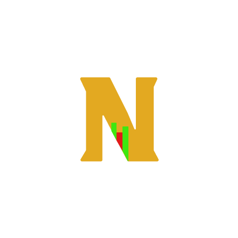
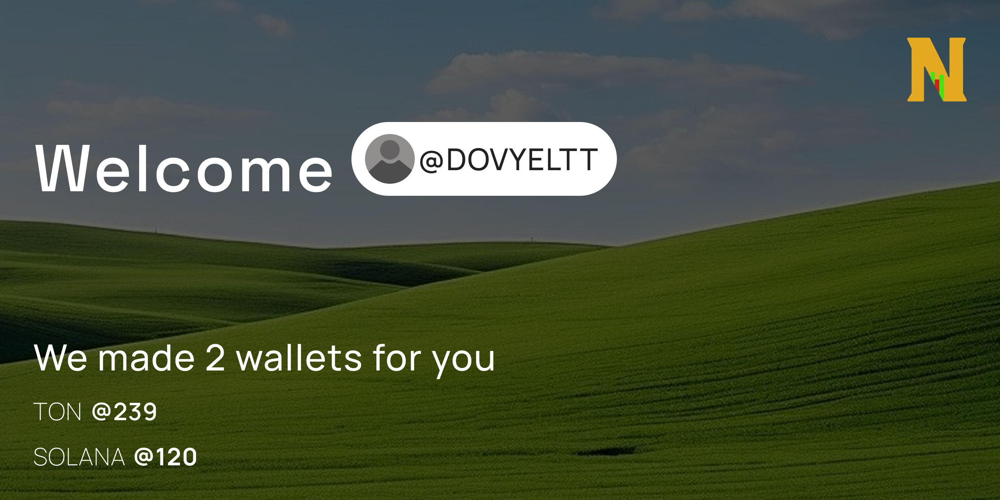
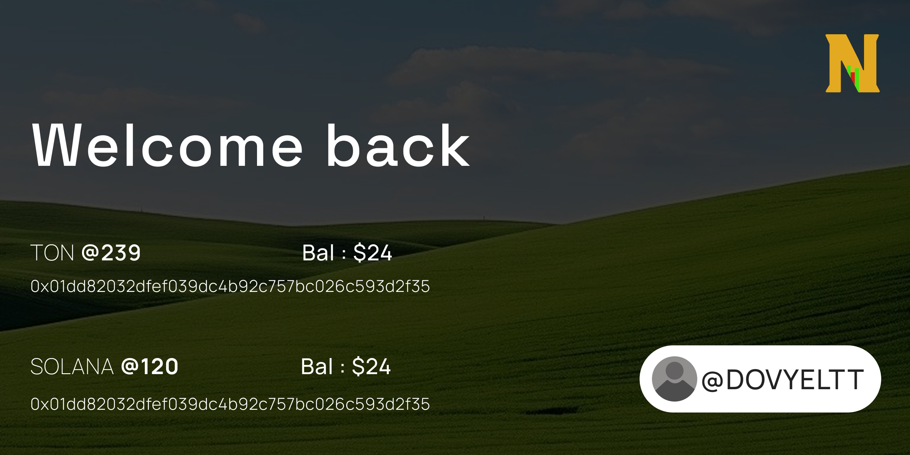
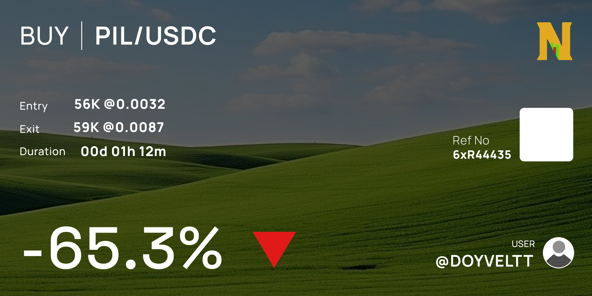
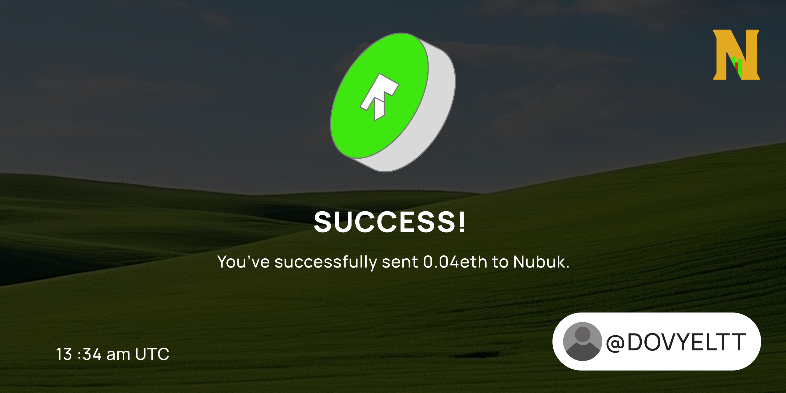
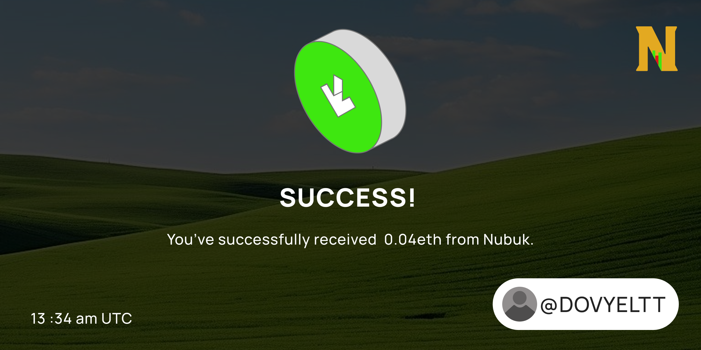

# 🚀 NottyBot – Your Text-Based DEX Trading Companion

**Trade. Compete. Play.**  
*A Telegram bot revolutionizing crypto trading simulations on TON & SOL blockchains*


---

## 🔥 What Makes NottyBot Special?

We blend **DeFi education** with **gamified engagement** through:
- **Visual Trading Journeys** �🖼️  
  Dynamic image generation for welcome screens, PNL reports, and achievement unlocks
- **Battle Royale Leaderboards** 🏆  
  Compete in weekly trading challenges with real-time ranking updates
- **Referral Frenzy System** 🎡  
  Earn fixed bonuses + spin a mystery reward wheel for referrals
- **Zero-Risk Sandbox** �  
  Simulate swaps using live Solana token data without real funds

---

## ✨ Key Features

### **Immersive Visual Experience**
- Auto-generated personalized banners
- Progress-triggered achievement cards
- Animated PNL breakdowns (profit/loss charts)

### **Real Market Simulation**
- Live Solana token price feeds
- Swap engine with slippage simulation
- Historical trade replay system

### **Social Competition**
- Live updating leaderboards
- Role-based badges (Whale, Diamond Hands, etc.)
- Cross-chat global ranking visibility

### **Gamified Growth**
- Referral bonus multiplier streaks
- Daily spin-to-win rewards
- Surprise "market crash" events

---

## ⚙️ Technical Highlights

```bash
Node.js | PostgreSQL | TON SDK | Solana Web3.js | Node Canvas
```

- **99.9% Uptime Architecture**  
  Multi-instance load balancing + automatic failover
- **Instant Response Engine**  
  Cached market data + async image rendering
- **Secure Backend**  
  Encrypted session management + anti-spam filters

---

## 🗺️ Development Roadmap

### ✅ Completed (Hackathon MVP Core)
- **Visual Storytelling Engine**
  - [x] Welcome/welcome back image generation
  - [x] Dynamic PnL charts with node-canvas
  - [x] Transaction receipt templates

- **Solana Integration**
  - [x] SOL token metadata fetcher
  - [x] Swap simulation engine
  - [x] Auto wallet address generation

- **Core Infrastructure**
  - [x] PostgreSQL database architecture
  - [x] Redis caching layer
  - [x] Basic command handlers

### 🔄 In Progress 
- **TON Network Expansion**
  - [⏳] TON mainnet trading simulation
  - [⏳] TON Connect wallet integration
  - [⏳] Jetton token support

- **Gamification Suite**
  - [⏳] Trading mini-game prototype
  - [⏳] Daily login streak rewards
  - [⏳] Basic referral wheel mechanics

*Current Focus: Completing cross-chain swap simulations by [DD/MM]*

### 🚀 Next Milestones

- **Cross-Chain Features**
  - [ ] SOL↔TON bridge simulation
  - [ ] EVM chains integration (Arbitrum, Base)
  - [ ] Gas fee prediction system

- **Advanced Trading**
  - [ ] Limit order simulations
  - [ ] Technical analysis toolkit
  - [ ] Paper trading competitions

- **Social Features**
  - [ ] Clan/group trading battles
  - [ ] Copy trading leaderboards
  - [ ] Trade history sharing as NFTs

- **UI/UX Enhancements**
  - [ ] Animated price charts
  - [ ] Interactive asset discovery quiz
  - [ ] Voice-based commands

- **Infrastructure**
  - [ ] Dockerized deployment
  - [ ] Load test setup (50k+ users)
  - [ ] Grafana monitoring dashboard

### 🌌 Stretch Goals (Post-Hackathon)

- **DeFi Integrations**
  - [ ] Lending protocol simulations
  - [ ] Yield farming strategies
  - [ ] NFT collateralization

- **AI Features**
  - [ ] Trade pattern recognition
  - [ ] Risk assessment chatbot
  - [ ] Sentiment analysis feed

- **Community DAO**
  - [ ] $NOTTY governance token
  - [ ] Feature voting system
  - [ ] Bot customization marketplace

---

## 🖼️ Visual Preview

| Feature         | Preview |
|----------------|---------|
| Welcome        |  |
| Welcome Back  |  |
| PNL           |  |
| Sent SOL      |  |
| Received SOL  |  |

---

## 👥 Built With Passion By

**Hackathon Team [Notty]**  
- **[@Mbdulrohim]** – Core Developer  
- **[@iamadetoye]** – Database Architect  
- **[@UX_Geek]** – UI/UX Designer  
---

## ⚡ Quick Start

1. Add bot: [@NottyBot](https://t.me/NottyTradingBot)
2. Type `/start` to begin
3. Send a SOL or TON contract


---

## 📜 License

MIT Licensed - Fork, but credit the OG builders! 🛠️

---
*Star ⭐ | Share 📤 | Support 💸*
